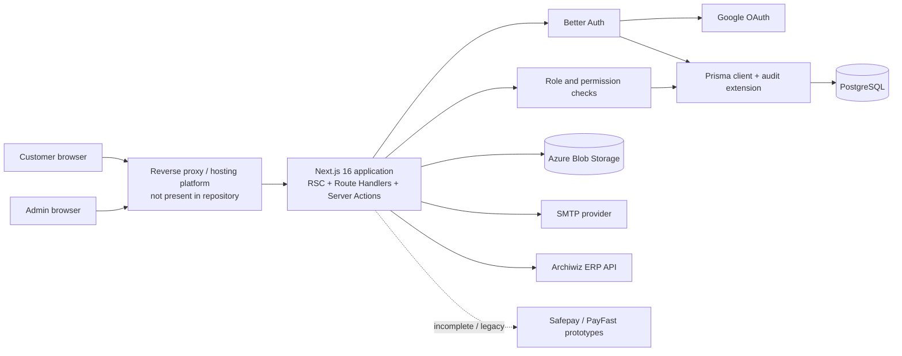
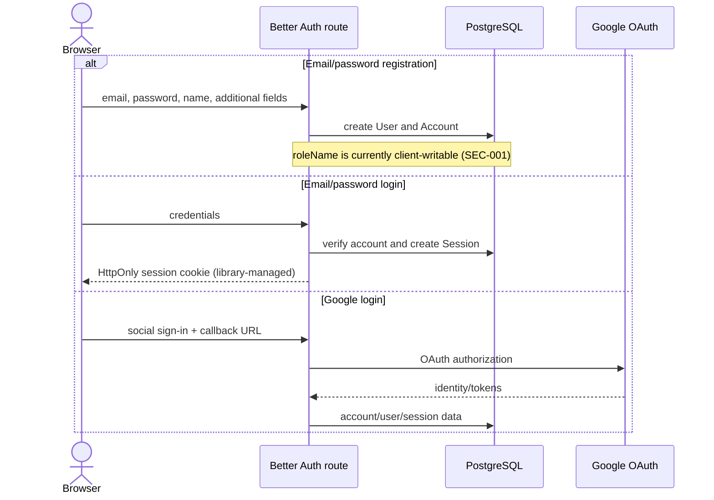
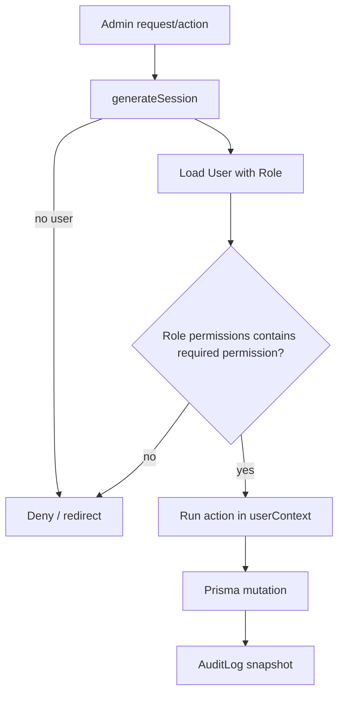
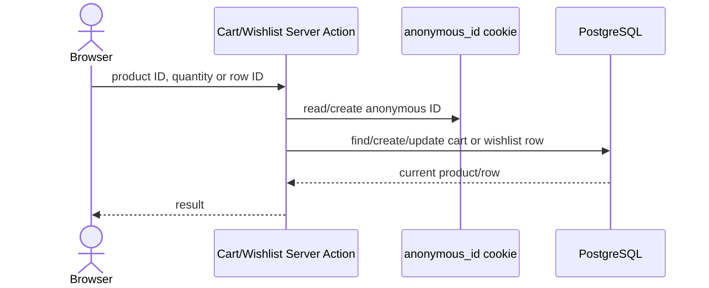
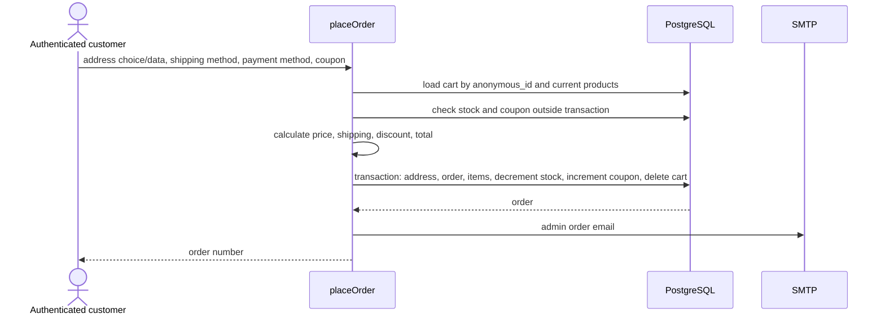
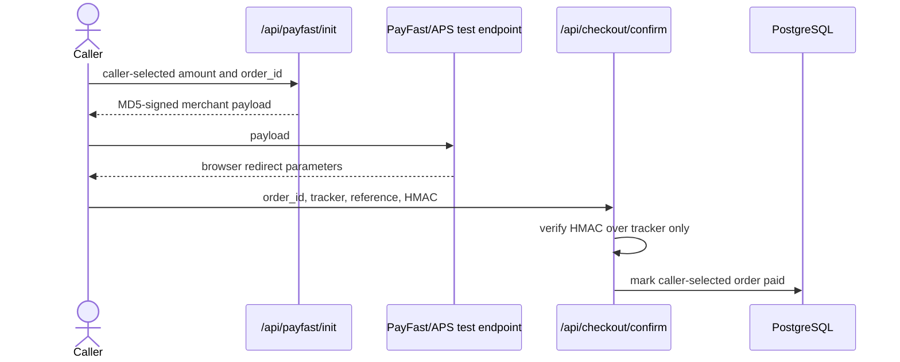
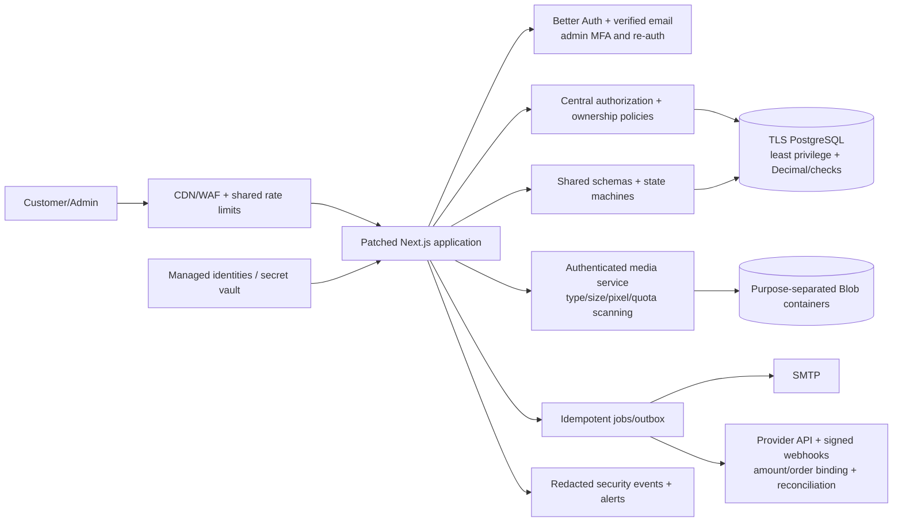

# Architecture and Data Flow

## Document status

This document describes the repository at commit `a39db8c338a7d0a8c3df03296473aff091ef666b` as reviewed on 2026-08-11, including uncommitted working-tree changes present at review time. It is a static architecture assessment. Cloud topology, deployed headers, network controls, identity configuration, backups, and provider dashboards were not available.

## System context

Qaam.pk is a Next.js monolith. React Server Components, Client Components, Route Handlers, and Server Actions share one deployable application and one Prisma/PostgreSQL data layer. Admin and customer routes are separated by App Router route groups, not separate services or security zones.

### Trust boundaries

1. **Internet to application:** all route parameters, query parameters, JSON, FormData, cookies, headers, and Server Action arguments are untrusted.
2. **Customer to admin:** a session is not sufficient for admin access; a server-side permission check is required on every action and read.
3. **Application to PostgreSQL:** Prisma parameterizes normal ORM queries, but application-level ownership, monetary, state-transition, and concurrency invariants remain the application's responsibility.
4. **Application to Azure:** the storage connection string can create/delete blobs. Public blob URLs cross a confidentiality boundary.
5. **Application to identity/payment/email/ERP providers:** responses and callbacks require provider-specific validation; provider contracts and data locations are organizational dependencies.
6. **Runtime to deployment environment:** environment variables contain database, OAuth, storage, SMTP, and payment credentials. Deployment configuration was unavailable.

## Component inventory

| Component | Location | Responsibility | Sensitive assets |
| --- | --- | --- | --- |
| Public storefront | `app/(site)`, `components/v2` | Catalog, cart, wishlist, content, account UI, checkout | Search terms, anonymous ID, account and order data |
| Customer actions | `lib/action/*` | Cart, wishlist, addresses, orders, reviews, subscriptions | User IDs, PII, cart/order state |
| Admin UI | `app/(admin)/admin/(admin)`, `components/Admin` | Commerce and content administration | Pricing, inventory, PII, RBAC, settings |
| Route Handlers | `app/api` | Auth, search, payment callbacks, test importer | Sessions, products, payment state |
| Authentication | `lib/auth.ts`, `lib/auth-client.ts`, `lib/generate-session.ts` | Better Auth email/password, Google OAuth, sessions | Password hashes, session tokens, OAuth tokens |
| Authorization | `lib/auth-utils.ts`, `lib/action-utils.ts`, `RoleGuard` | Role lookup and permission enforcement | Roles and permission arrays |
| Data layer | `lib/prisma.ts`, `prisma/schema.prisma` | PostgreSQL access and mutation audit snapshots | All application and personal data |
| Media | `lib/action/FileUpload.tsx`, `lib/azure-upload.ts` | Image conversion/upload/delete | Storage credential, public media, avatars |
| Email | `lib/mailer.ts` | Password-reset and order emails | Email address, reset link, order metadata |
| Payment prototypes | `app/api/checkout/confirm`, `app/api/payfast/init`, `lib/payfast.ts`, `lib/payments/aps.ts` | Signing/initiation and callback handling | Payment secrets, tracker/reference, order status |
| ERP integration | `app/(admin)/admin/actions/erp-sold-items.ts` | Lookup and reconciliation of sold stock | Product titles, inventory decisions |
| Scraper/import utility | `testing-product-python/main.py`, `app/api/test-upload` | Third-party catalog scrape/import | Third-party product text/images, catalog integrity |

No analytics SDK or dedicated background-job route was found. `inngest` is installed but no Inngest route/function was found in the reviewed source.

## Route and attack-surface map

### Public and customer routes

| Area | Representative routes | Intended access | Data/operation |
| --- | --- | --- | --- |
| Catalog/content | `/`, `/shop`, `/product/[id]`, `/about`, `/blog`, `/faq`, `/[slug]` | Public | Products, CMS HTML, search/filter inputs |
| Anonymous commerce | `/cart`, `/wishlist`, `/recently-viewed` | Public with `anonymous_id` cookie | Cart/wishlist/history mutations |
| Authentication | `/login`, `/register`, `/forgot-password`, `/reset-password`, `/api/auth/[...all]` | Public | Account/session/reset operations |
| Customer account | `/dashboard/*` | Authenticated | Profile, password, addresses, orders |
| Checkout | `/checkout`, `/order-confirmation/[orderNumber]` | Authenticated | Address, cart, coupon, order creation |
| Contact/subscription/reviews | `/contact` plus Server Actions | Public | Contact PII, email, review content |
| Placeholder | `/track-order`, `/returns-exchanges` | Public | Track-order form is not wired to a handler |

### Admin routes

All `/admin/*` pages share a layout session check. The layout rejects only the literal customer role `user`; page-level `RoleGuard` and action-level `withPermission` are expected to enforce actual permissions.

| Module | Route family | Permission family |
| --- | --- | --- |
| Dashboard and ERP review | `/admin`, internal admin actions | Mixed; dashboard reads are currently unguarded |
| Users and RBAC | `/admin/users`, `/admin/customers`, `/admin/role` | `user_*`, `role_*` |
| Catalog | `/admin/products`, `/admin/category`, `/admin/subcategory`, `/admin/brand`, `/admin/grading` | `product_*`, `category_*`, `brand_*`, `grading_view` |
| Merchandising/content | `/admin/slider`, `/admin/banner`, `/admin/blog`, `/admin/faq`, `/admin/page`, `/admin/about/*` | Module-specific permissions |
| Commerce | `/admin/coupon`, `/admin/orders`, invoice route | `coupon_*`, `order_*` |
| Customer communications | `/admin/contact`, `/admin/subscribe` | `contact_*`, `subscriber_*` |
| Configuration/logs | `/admin/setting/*`, `/admin/logs/*` | `settings_*`, `audit_view`, `login_view` |

Page guards do not protect Server Actions by themselves. Findings SEC-002 and SEC-008 document missing action-level enforcement.

### Route Handlers

| Method and route | Intended access | Validation | Sensitive effect | Review result |
| --- | --- | --- | --- | --- |
| `GET/POST /api/auth/[...all]` | Public/authenticated as appropriate | Better Auth | Account and session lifecycle | Role field misconfigured; dependency advisories |
| `GET /api/products?q=` | Public | Non-empty string only | Returns all matching active products | No result cap/rate limit |
| `POST /api/test-upload` | Should be internal/admin | None | Creates active products | Unauthenticated mass assignment |
| `POST /api/payfast/init` | Should bind to authenticated order | None | Produces merchant-signed payload | Caller supplies amount/order; legacy |
| `GET /api/checkout/confirm` | Payment provider/browser callback | HMAC of tracker only | Marks order paid/failed | Order/amount/provider state not bound; replay risk |

No `/api/payfast/ipn` route exists even though it is configured as `notify_url`. No refund or provider reconciliation implementation was found.

## Authentication flow

Observed controls:

- Better Auth/Prisma handles password hashing and database sessions.
- Customer dashboard layout checks the session server-side.
- The anonymous commerce identifier is a separate HttpOnly, production-Secure 30-day cookie.
- Password reset email is sent through SMTP.

Important gaps:

- `roleName` is an input-enabled Better Auth additional field.
- Email verification, admin MFA, robust distributed throttling, and privileged re-authentication are not configured.
- Forgot-password performs explicit account enumeration.
- Password change leaves other sessions active.
- Deployed cookie attributes and expiration require runtime verification.

## Authorization flow

This intended path is implemented by `withPermission`. Several high-impact actions bypass it, and direct layout/page access checks are inconsistent. The audit context is also lost for actions not wrapped by `withPermission`, producing `changedBy = SYSTEM`.

## Cart and wishlist flow

The newer read/add paths scope by anonymous ID. Direct remove/update by row ID do not consistently verify ownership, and older `home.action.ts` actions accept caller-supplied user IDs. Cart/wishlist tables lack owner/product uniqueness and quantity check constraints.

## Checkout and order flow

Positive design choices:

- Product prices and shipping fee are recalculated on the server.
- The current session supplies `userId`.
- A saved address is checked against the session user.
- Order creation, item creation, stock mutation, coupon count, and cart deletion share one transaction.

Missing invariants:

- Quantity is not required to be a positive integer before it reaches checkout.
- Fixed coupon discount is not capped to subtotal; total is not constrained non-negative.
- Stock/coupon prechecks are outside the transaction and decrements are unconditional.
- There is no checkout idempotency key or unique attempt record.
- Money uses binary floating-point fields.

### Order lifecycle

The schema supports `PENDING`, `PROCESSING`, `SHIPPED`, `DELIVERED`, and `CANCELLED`; payment supports `PENDING`, `PAID`, `FAILED`, and `REFUNDED`. The application does not implement a central transition policy. Admin actions can set status directly, and one pair of those actions lacks authorization. Refund orchestration was not found.

## Payment flows

### Active customer checkout

The current checkout UI and `PlaceOrderInput` expose only cash on delivery and bank transfer. Both create a `PENDING` payment status. Admins can use guarded invoice/payment-recording actions, but legacy unguarded status setters coexist.

### Legacy/prototype online payment

This flow is disconnected and unsafe. There is no authenticated order binding, amount/currency verification, provider-side transaction lookup, replay/idempotency record, or IPN handler. Treat all online payment routes as disabled until redesigned and provider-certified.

## Sensitive-data inventory and flow

| Data | Collected from | Processed by | Stored in | Shared with | Retention/deletion |
| --- | --- | --- | --- | --- | --- |
| Name/email | Registration, profile, OAuth | Better Auth, app | `User`, `Account` | Google OAuth, SMTP; avatar fallback service receives encoded name | No customer export/delete workflow; policy absent |
| Password | Registration/change/reset | Better Auth | Hash in `Account.password` | Not intentionally shared | Session revocation behavior partly library-managed |
| OAuth/session tokens | Google/Better Auth | Better Auth | `Account`, `Session` | Google/DB | Encryption/rotation/retention need verification |
| Address/phone | Address book, checkout | Customer/order actions | `Address`; duplicated in audit snapshots on create/update | Admin UI; order email may include customer email | No retention schedule; deletion constrained by orders |
| Orders/history | Checkout | Order/admin actions | `Order`, `OrderItem` | Admin and SMTP | No policy; audit snapshots add copies |
| IP/user agent | Auth/session headers | Better Auth; unused login-log helper | `Session`, potentially `LoginLog` | Admin log UI | No retention schedule |
| Payment references | Callback/admin entry | Payment/order actions | `Order` | Payment provider/admin | No reconciliation or retention policy |
| Contact/newsletter | Public forms | Server Actions | `Contact`, `Subscribe` | Admin; downstream marketing use not shown | Admin delete exists; public unsubscribe does not |
| Reviews | Public form | Review action | `Review` including optional email | Public review output can expose email through actions; avatar service receives name | No moderation/retention policy |
| Images/avatars | Customer/admin upload | Sharp/Azure client | Public Azure blob plus URL in DB | Azure/public internet | Delete is not owner-bound; lifecycle unknown |
| Audit snapshots | All Prisma create/update/delete hooks | Prisma extension | `AuditLog.oldData/newData` | Admin audit UI | Full-record duplication; no retention/redaction |
| Product titles | Catalog/admin | ERP queries | App and ERP cache | Archiwiz ERP | In-memory cache; provider governance unknown |

## Database architecture

The PostgreSQL schema contains 27 models: catalog entities, users/roles/sessions/accounts, anonymous commerce state, reviews, addresses, orders/items/coupons, CMS/settings, subscribers/contacts, security logs, and grading.

Notable integrity characteristics:

- `User.email`, `Role.name`, `Order.orderNumber`, `Coupon.code`, page/blog slugs, and setting keys are unique.
- Cart and wishlist owner/product combinations are not unique.
- Quantities, rating ranges, monetary non-negativity, coupon counts, and valid owner identity are not enforced with database checks.
- Monetary values use `Float`/PostgreSQL double precision.
- The committed migration directory does not represent the full schema.
- Prisma query extensions snapshot most creates/updates/deletes to `AuditLog` without field redaction.

No raw SQL execution was found, reducing conventional SQL-injection exposure. Database encryption, backups, network firewall, server configuration, and runtime role privileges were not available.

## Storage and upload flow

`uploadImage` buffers a Server Action upload, sends it through Sharp, converts it to WebP, and writes it using an account-level Azure connection string. It has no internal authentication, explicit size/type/signature policy, quota, or malware handling. The Next Server Action body cap is 10 MB.

`uploadToAzure` stores the original bytes and caller MIME type. It is passed to the admin rich-text editor and can create publicly reachable active content. Delete helpers accept a URL and derive the blob key without authorization or ownership metadata.

Recommended target architecture:

- Separate private customer avatars and public CMS/product assets.
- Use short-lived scoped upload grants or an authenticated upload service.
- Validate byte signatures, decode/re-encode allowed raster formats, cap pixels/dimensions/size/count, generate server-side names, and scan when required.
- Store media ownership and purpose in PostgreSQL; authorize deletion against that record.
- Use a restricted managed identity instead of a long-lived account connection string where supported.

## Caching, scalability, and availability

- Public catalog functions use `unstable_cache`; invalidation is manual and inconsistent.
- Rate limiting uses a process-local `Map`, so it resets on restart and is not shared between instances or regions.
- Dashboard ERP lookups use a process-local one-minute cache and a six-request concurrency limit.
- Product search API returns every match and has no request/response bound.
- Uploads buffer entire files in memory and process them synchronously.
- Order stock and coupon decisions are vulnerable to concurrent requests.
- No queue/background worker is implemented despite `inngest` being installed.

## Deployment model and unknowns

The repository has no Dockerfile, IaC, Azure/Vercel configuration, CI workflow, WAF/CDN policy, monitoring configuration, or runtime health checks. The following require operational evidence:

- Actual hosting platform, TLS termination, HTTPS redirects, HSTS, and response headers
- PostgreSQL firewall/private networking, TLS verification, encryption, backups, restore tests, and least privilege
- Azure container access level, CORS, lifecycle, soft delete/versioning, encryption, and logging
- Secret-store use, rotation history, and separation between environments
- SMTP, Google, ERP, Safepay, and PayFast production configurations and contracts
- Central logs, alerting, incident response, retention, and access reviews
- Production route reachability for legacy Server Actions/payment routes

## Target security architecture

The implementation sequence is in [REMEDIATION_PLAN.md](REMEDIATION_PLAN.md).
