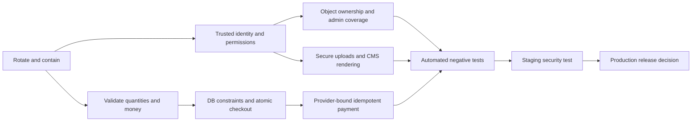

# Security Remediation Plan

**Application:** Qaam.pk e-commerce  
**Based on:** `SECURITY_AUDIT_REPORT.md`, reviewed 2026-08-11  
**Current release recommendation:** Do not promote the reviewed build to production until the Phase 0 and Phase 1 exit criteria are met.

This plan orders work by exploitability and business impact, then by dependency. Effort is an engineering estimate, not a delivery commitment: **Low** is generally under two engineer-days, **Medium** is approximately three to ten engineer-days, and **High** is a multi-sprint or cross-team change. Infrastructure, provider, and legal work may add elapsed time.

## Prioritized remediation register

| Priority | Finding | Severity | Effort | Recommended action | Status |
| ---: | --- | --- | --- | --- | --- |
| 1 | SEC-005 — Disclosed database credential | High | Low | Rotate the credential immediately, revoke the old value, update the secret store, and inspect database/authentication logs. | Open |
| 2 | SEC-001 — Client-writable role | Critical | Low | Set Better Auth `roleName` to non-input, assign `user` only on the server, audit privileged users, and revoke existing sessions. | Open |
| 3 | SEC-002 — Unguarded order administration | Critical | Low–Medium | Apply exact read/update permissions to every order action and test anonymous, customer, and cross-role denial. | Open |
| 4 | SEC-004 — Invalid checkout numeric states | Critical | Medium | Require positive integer quantities, recompute and cap discounts, reject non-positive totals, and add database constraints. | Open |
| 5 | SEC-003 — Unbound/replayable payment confirmation | Critical | High | Block legacy endpoints now; redesign confirmation around provider-verified amount, currency, order identity, status, replay protection, and idempotency. | Open / reachability to verify |
| 6 | SEC-006 — Public product importer | High | Low | Remove `/api/test-upload` from production or protect it with a narrowly scoped import permission and strict schema. | Open |
| 7 | SEC-008 — Admin authorization bypasses | High | Medium | Inventory every server action and require a mutation-specific permission inside each action. Correct permission-name drift. | Open |
| 8 | SEC-007 — Customer BOLA/caller-controlled identity | High | Medium | Derive identity from the session and scope every object query/mutation by owner in one database predicate. Retire legacy actions. | Open / legacy reachability to verify |
| 9 | SEC-009 — Unprotected file storage mutation | High | Medium | Authorize upload/delete, allowlist decoded media types, cap bytes/pixels, generate server names, and track ownership. | Open |
| 10 | SEC-010 — Stored/reflected XSS sinks | High | Medium | Sanitize CMS HTML on write/render and safely serialize JSON-LD by escaping HTML-significant characters. | Open |
| 11 | SEC-011 — Inventory/coupon/order race conditions | High | High | Use conditional atomic stock updates, database-backed coupon redemption, and checkout idempotency keys. | Open |
| 12 | SEC-012 — Vulnerable dependency baseline | High | Medium–High | Upgrade direct dependencies, re-resolve transitive packages, regression-test auth/payment/UI, and enforce audit policy in CI. | Open |
| 13 | SEC-014 — Authentication abuse controls incomplete | Medium | Medium | Add durable rate limiting, enumeration-safe recovery, admin MFA, verified-email policy, and reauthentication for sensitive actions. | Open |
| 14 | SEC-015 — Unvalidated login redirect | Medium | Low | Accept only same-origin relative paths from an allowlist and use a safe default destination. | Open |
| 15 | SEC-016 — Missing global security headers | Medium | Low | Add CSP, HSTS after HTTPS validation, frame, MIME, referrer, and permissions controls; test report-only CSP first. | Open |
| 16 | SEC-017 — Validation/pagination/error gaps | Medium | Medium | Add shared schemas and bounds to every boundary, paginate list APIs, and return stable public error codes. | Open |
| 17 | SEC-018 — Sensitive logging/security telemetry gaps | Medium | Medium | Remove secrets and payloads from logs, redact identifiers, correlate requests, and emit actionable security events. | Open |
| 18 | SEC-019 — Database integrity/migration gaps | Medium | High | Replace floating money with decimal/minor units, add ownership/uniqueness/check constraints, and establish reviewed migrations. | Open |
| 19 | SEC-013 — Audit log privacy and integrity | Medium | Medium | Store minimal diffs, reliably attribute actors, restrict access, define retention, and export to tamper-resistant storage. | Open |
| 20 | SEC-020 — Privacy notice/rights/retention gaps | Medium | High | Confirm jurisdictions, publish accurate notices, implement rights workflows, retention/deletion schedules, and processor records. | Open / legal validation required |
| 21 | SEC-021 — Missing secure delivery gates | Medium | Medium | Add unit/integration/security tests and CI gates; stop ignoring TypeScript build errors and enforce lint/audit thresholds. | Open |
| 22 | SEC-022 — Cookie/recovery/session correctness | Low | Low | Set explicit cookie attributes, correct the reset route, escape user-derived email content, and test session invalidation. | Open |
| 23 | SEC-023 — Legacy/backup/scraper surface | Informational | Medium | Remove or quarantine obsolete code, document intentionally deployed routes, and add license/content provenance. | Open |

## Phase 0 — Contain immediately

Target: same business day. These controls reduce exposure while permanent fixes are developed.

1. Rotate the database credential exposed outside the secret store. Revoke the prior credential rather than merely adding a second credential; update each approved runtime and verify the old value fails.
2. At the application or edge layer, block `/api/test-upload`, `/api/payfast/init`, and `/api/checkout/confirm`. Confirm that no equivalent aliases or older deployment retain them.
3. Disable checkout if negative/zero quantities and totals cannot be rejected at both request and database boundaries immediately.
4. Make `roleName` non-writable by public auth payloads. Review all users with non-customer roles, correlate their creation/update history, and revoke affected sessions.
5. Temporarily restrict admin access by identity-aware proxy or network policy while the action-by-action authorization repair is underway.
6. Preserve relevant authentication, database, order, payment, and deployment logs for incident review without copying credentials into tickets or chat.

### Phase 0 exit criteria

- The old database credential is proven invalid and the replacement exists only in the approved secret store.
- The three legacy/test endpoints return a controlled denial from the deployed edge and application.
- A public sign-up/update payload cannot assign or change a role.
- Anonymous and ordinary-user calls cannot invoke any order-management mutation or enumerate order PII.
- A documented owner has reviewed privileged accounts, recent product changes, payment-status changes, and suspicious database access.

## Phase 1 — Repair critical trust boundaries

Target: before the next production release.

### Authentication and authorization

- Centralize `requireSession`, `requireAdmin`, and `requirePermission` server helpers. Deny by default, query the current role from trusted storage, and never authorize from client-supplied user/role identifiers.
- Apply the helpers inside every server action and route handler, not only in layouts or hidden UI controls.
- Use explicit permissions for order read, order-status update, payment-status update, settings, grading, About/CMS content, products, uploads, and reporting.
- Add authorization tests using anonymous, customer, limited-admin, and full-admin identities, including direct action requests that bypass the UI.

### Checkout integrity

- Parse input using a shared runtime schema. Quantity must be a safe positive integer and bounded per line/order.
- Load price, availability, product identity, shipping rules, and coupon rules from the server. Use fixed-precision decimals or integer minor units.
- Within a database transaction, perform conditional stock decrements (`stock >= requested`), record coupon redemption, create the order, and reject any non-positive/overflow total.
- Add a unique idempotency key scoped to the customer/cart/checkout attempt; replay must return the original result and never decrement stock twice.

### Payment containment and redesign

- Keep incomplete PayFast/Safepay endpoints disabled until their provider integration is documented and tested in a sandbox.
- Map provider transaction IDs to a server-created pending payment. Verify the provider signature using its documented algorithm, compare amount and currency with the stored order using exact arithmetic, validate allowed state transitions, and make webhook processing idempotent.
- Treat browser redirects as display/navigation signals only. A signed, authenticated server-to-server notification or verified provider API lookup must determine payment status.

### Phase 1 exit criteria

- All SEC-001 through SEC-010 controls have code review and automated negative tests.
- Checkout tests cover zero/negative/fractional/huge quantities, manipulated prices, oversized discounts, out-of-stock races, duplicate requests, and cross-user object IDs.
- Payment sandbox tests cover altered order ID/amount/currency, invalid signature, replay, out-of-order messages, provider timeout, duplicate delivery, and refund/cancel transitions.
- The application has no anonymous route capable of creating products or deleting/uploading blobs.

## Phase 2 — Data integrity and platform hardening

Target: the following one to two sprints.

- Introduce reviewed Prisma migrations for exact money types, positive/non-negative checks, owner/product uniqueness, payment/provider uniqueness, and lifecycle constraints. Rehearse migration and rollback on a sanitized production-like copy.
- Implement atomic inventory and coupon operations and load-test concurrent checkout attempts.
- Sanitize rich content with a documented allowlist; add regression payloads for script tags, event handlers, SVG/data URLs, and `</script>` in JSON-LD.
- Upgrade the vulnerable dependency tree. Prioritize Better Auth and Next.js, then Swiper, Inngest, Nodemailer, Sharp, Prisma, PostCSS, and UUID. Do not rely on audit counts alone; execute auth, image, editor, email, checkout, and admin regression tests.
- Add durable distributed rate limiting, admin MFA, reauthentication for dangerous actions, safe redirect handling, explicit cookie policy, global response headers, and request-size limits by endpoint.
- Reduce audit logs to security-relevant metadata/diffs and apply access control, integrity protection, redaction, alerting, and retention.

### Phase 2 exit criteria

- Clean build and lint gates run in CI; TypeScript errors cannot be ignored.
- Production dependencies have no accepted critical/high advisory without a named owner, compensating control, expiry, and approval.
- Concurrency tests prove stock cannot become negative and a coupon/payment/order cannot be consumed twice.
- Security headers pass browser functional testing and an independent header/CSP scan.
- File tests reject type spoofing, decompression bombs, excessive dimensions/size, SVG active content, unauthorized deletion, and filename collisions.

## Phase 3 — Privacy, operations, and assurance

Target: planned with legal, privacy, infrastructure, and operations owners.

- Create an authoritative data inventory covering accounts, addresses, orders, reviews, support messages, analytics, blobs, email, payment references, ERP/WhatsApp transfers, backups, and logs.
- Publish a notice that matches actual processing. Implement authenticated export, correction, deletion/restriction, consent/objection, and unsubscribe workflows with fraud/tax/legal-hold exceptions documented.
- Approve retention periods by data class and enforce deletion in primary databases, blobs, logs, and backup lifecycle. Minimize PII copied into audit logs.
- Confirm payment architecture and merchant obligations with the acquirer/provider. Complete the applicable PCI DSS scope assessment; do not claim compliance based on this source review.
- Verify production TLS, HSTS, WAF/CDN, firewall rules, database and blob private access, least-privilege identities, key rotation, backup encryption/restore tests, monitoring, alerting, incident response, and disaster recovery.
- Remove obsolete backups/scrapers/routes, document ownership and third-party provenance, and establish periodic penetration tests and access reviews.

### Phase 3 exit criteria

- Legal/privacy owners approve the notice, lawful bases, processor/subprocessor record, rights workflows, and retention schedule for each served jurisdiction.
- Infrastructure evidence demonstrates least privilege, encryption, restore testing, monitored security events, and practiced incident response.
- A qualified external test validates authorization, checkout/business logic, payment webhooks, uploads, XSS, rate limits, and deployment configuration in a safe staging environment.
- Material findings are retested and closed with evidence; accepted risks have accountable owners and expiration dates.

## Dependencies and implementation order

Database constraints should follow application validation deployment where a constraint could reject existing malformed data; first identify and repair bad records. Dependency upgrades should be isolated into reviewable batches, but critical auth/framework advisories should not wait for unrelated feature work. Privacy and PCI decisions require legal/provider input, while engineering can begin data mapping, minimization, and rights-workflow design immediately.

## Required owners and evidence

| Workstream | Accountable role | Completion evidence |
| --- | --- | --- |
| Incident containment/secrets | Security or platform lead | Rotation record, denied old credential, incident review notes |
| Authentication/RBAC | Application security + backend lead | Permission matrix, tests, privileged-account/session review |
| Checkout/inventory | Commerce/backend lead | Schema rules, migrations, concurrency/idempotency test results |
| Payments | Payments owner + provider/acquirer | Integration design, sandbox results, webhook/reconciliation evidence |
| Uploads/CMS | Backend + content platform owner | Allowlists, authorization tests, malware/image controls, XSS tests |
| Dependencies/CI | Engineering productivity owner | Lockfile diff, regression results, CI policy and exception register |
| Infrastructure | Platform/cloud owner | TLS/WAF/IAM/network/storage/backup/monitoring configuration evidence |
| Privacy/compliance | Legal/privacy owner | Data map, notice, rights/retention procedures, processor agreements |
| Independent assurance | Security lead | Retest report, penetration test, risk acceptances with expiry |

## Release decision record

For every release while findings remain open, record the exact commit and deployment, open finding IDs, test evidence, compensating controls, accountable approver, and expiry date. Severity must not be reduced merely because an endpoint is absent from the current UI; deployed reachability and direct invocation must be tested.
